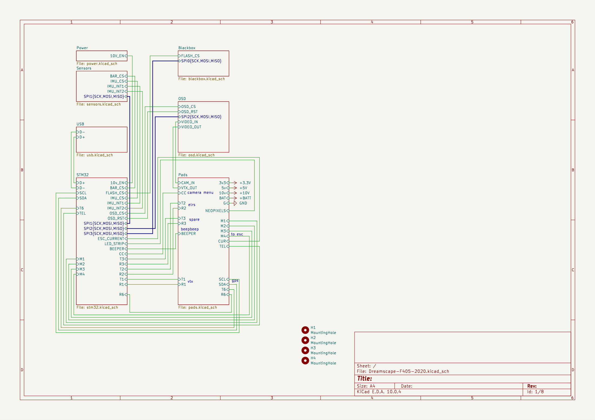
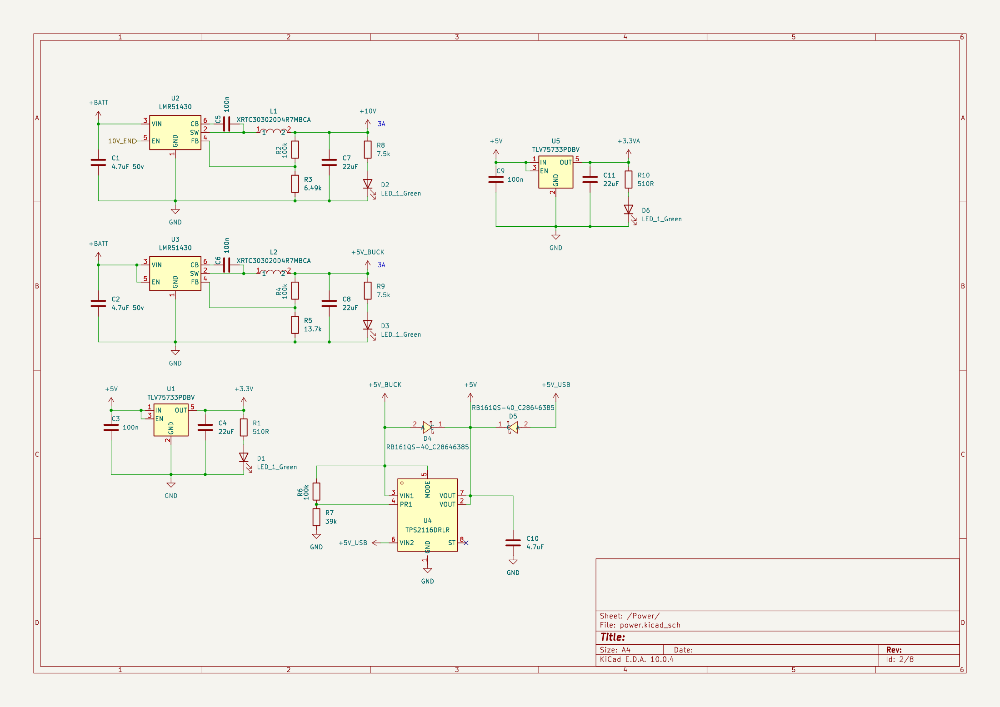
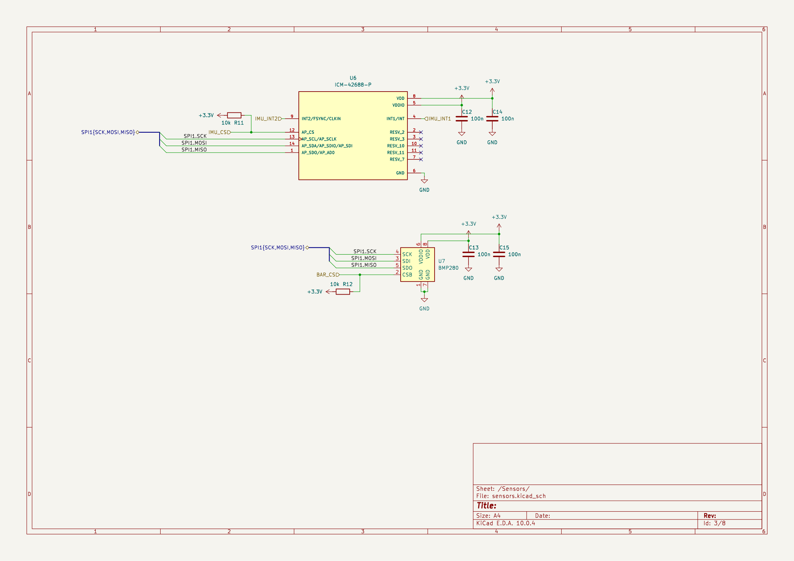
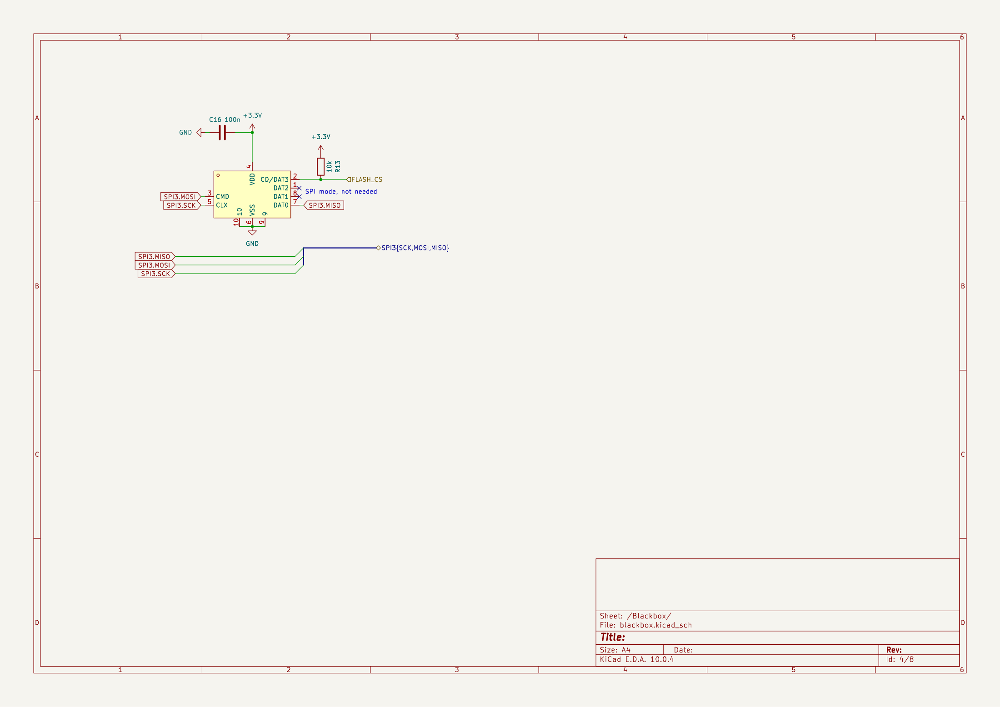
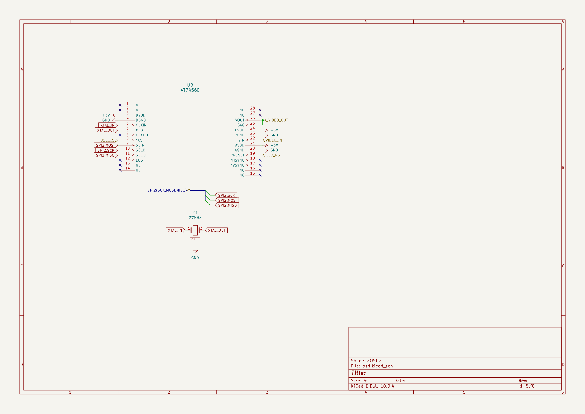
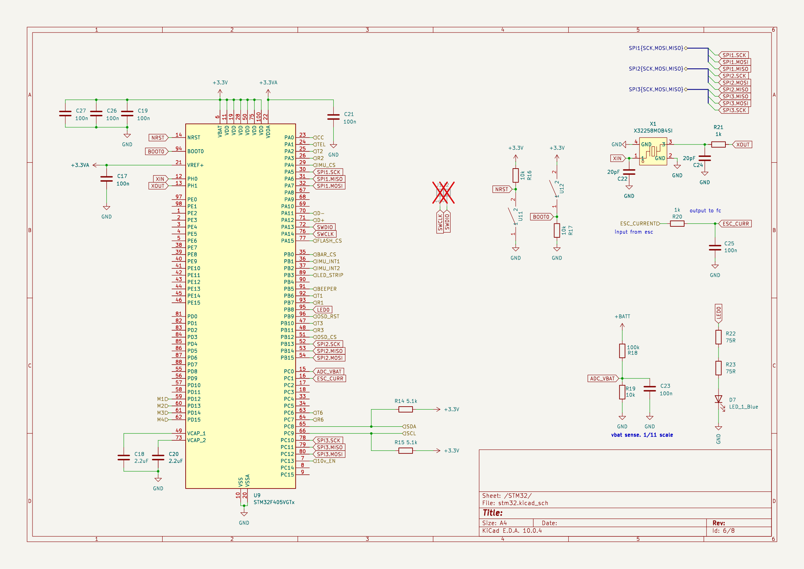
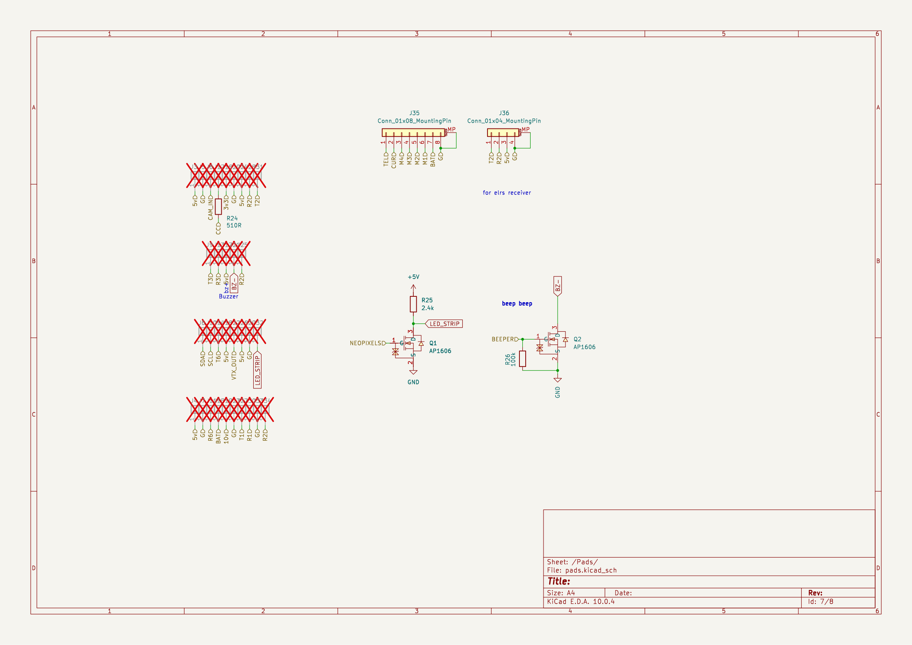
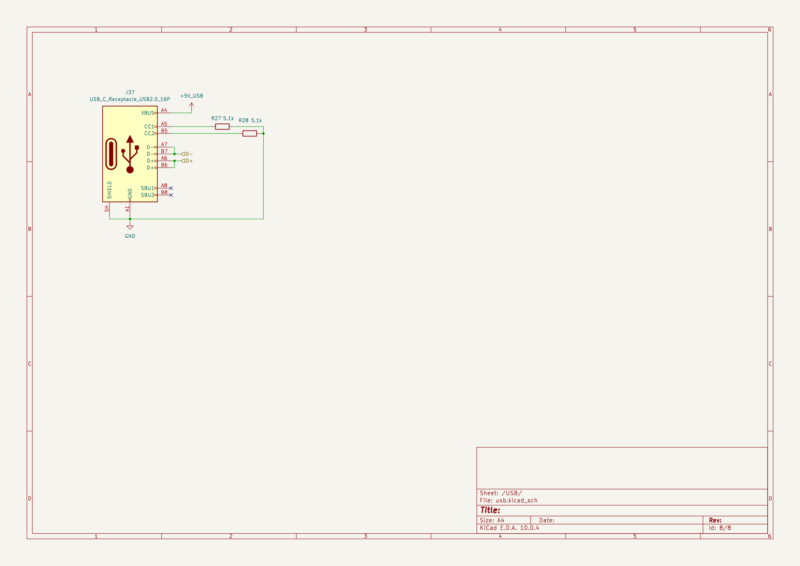
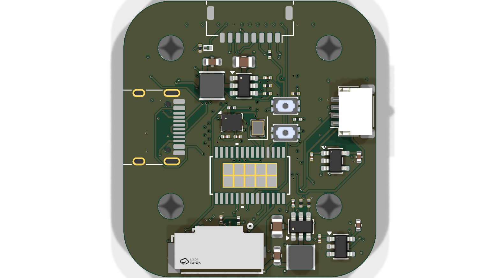

# August 2: Picking a brain (and the parts around it)

## What I did:

- started project
- using 20x20 mounting pattern
- planning on a 3" fpv drone
- picked the parts: STM32F405 MCU, ICM-42688-P IMU, BMP280 Barometer, AT7456E OSD, MicroSD Slot

## Why:

- this time the fc will have everything, no separate boards bolted together

## Screenshots:

**Total time spent: 3 hours**

# August 5: Power sheet

## What I did:

- first sheet: power
- 2 LMR51430 buck converters: 5v always on, 10v with enable
- TLV75733 for 3.3V from 5v
- TPS2116 power mux between 5v buck and USB 5v
- voltage divider to measure battery voltage

## Why:

- board auto-switches between USB and buck so it powers up on a bench without a battery
- wanted the camera/vtx rail separate so it can be turned off in software

## Screenshots:

**Total time spent: 3 hours**

# August 8: Sensors sheet

## What I did:

- started sensors sheet: ICM-42688-P IMU
- added BMP280 barometer
- copied reference circuits for both

## Why:

- IMU and baro share the same SPI bus (SPI1), one chip select each
- baro is extra work but knowing about air pressure helps in FPV

## Screenshots:

**Total time spent: 2 hours**

# August 11: Blackbox sheet

## What I did:

- microSD slot on a separate SPI bus
- using a push-pull slot

## Why:

- microSD is for Blackbox logging, don't want it hogging the fast gyro bus
- separate bus means the SD card can't stall the IMU

## Screenshots:

**Total time spent: 2 hours**

# August 14: OSD sheet

## What I did:

- using AT7456E for OSD
- careful about the signal path: Camera -> OSD -> VTX

## Why:

- super common OSD chip, lots of reference material
- the video path matters, a bad OSD kills the whole video feed

## Screenshots:

**Total time spent: 2 hours**

# August 18: STM32 sheet

## What I did:

- started the f405 sheet
- 8MHz crystal for the main clock
- spent a lot of time choosing which pins to assign

## Why:

- this chip has USB on it, no other usb chips needed
- pin assignment decides the whole board layout, worth the time now over rerouting later

## Screenshots:

**Total time spent: 4 hours**

# August 20: Pads sheet

## What I did:

- started the pads sheet
- JST-SH connector for the ESCs
- dedicated connector for ELRS

## Why:

- copying F405 Mini pad layout, it is a proven arrangement
- separate connectors keep the pads clean and easy to solder

## Screenshots:

**Total time spent: 3 hours**

# August 22: USB-C sheet

## What I did:

- started the USB-C sheet

## Why:

- usb vbus feeds the power mux so we can use and flash the board without a battery

## Screenshots:

**Total time spent: 1.5 hours**

# August 25: Placement and start of routing

## What I did:

- started routing the pcb
- f405 in the center
- power along one edge
- sensitive analog stuff kept away from the power stage
- using an inner ground layer

## Why:

- hopefully 4-layer is enough for clean power and signal return paths

## Screenshots:

**Total time spent: 4 hours**

# August 27: Routing done (+ DRC)

## What I did:

- finished routing, ran drc
- some clearance issues near the crystal
- some silk that was too close to pads
- retraced the current sense line because it runs past the buck converters on its way to the esc

## Why:

- power routing is hard and so is high speed data
- will fix the drc leftovers later

## Screenshots:

**Total time spent: 6 hours**

# August 28: Silkscreen labels on the pads

## What I did:

- started pad silkscreen labels
- labeled every pad on the board
- used abbreviated labels because full names are too long

## Why:

- every off-the-shelf fc has silkscreen on the pads, makes wiring easier at the bench
- spacing is so hard, especially with the 0201 parts, i need steady hands

## Screenshots:

**Total time spent: 1 hour**