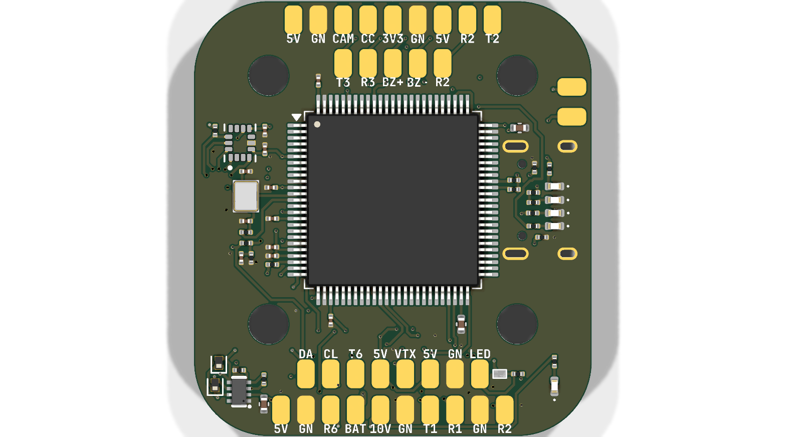
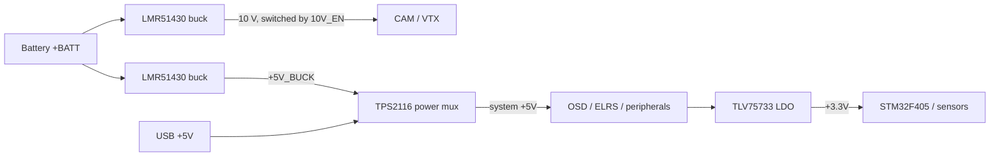

# Dreamscape F405

A 20 x 20 mm flight control board for a DIY FPV quad, designed and routed from scratch in KiCad around an STM32F405. It has an ICM-42688-P gyro, BMP280 barometer, an AT7456E analog OSD, a microSD blackbox, a firmware-switchable 10 V rail for the camera/VTX, and a dedicated plug for an ExpressLRS receiver.



## Why I made this

I kept seeing the insides of flight controllers on other people's builds and had no idea what most of it was. So instead of buying one, I decided to build my own and actually learn it: reading the gyro and regulator datasheets, picking parts, drawing the schematic, and routing the board by hand. The goal is to get a quad in the air running on a board I made myself, not something I ordered as a black box.

## Pictures

Full schematic, one image per sheet:

| Page | Sheet |
|---|---|
| 1 | [Root / block diagram](images/schematic/Dreamscape-F405-2020.png) |
| 2 | [Power](images/schematic/Dreamscape-F405-2020-Power.png) |
| 3 | [Sensors](images/schematic/Dreamscape-F405-2020-Sensors.png) |
| 4 | [Blackbox](images/schematic/Dreamscape-F405-2020-Blackbox.png) |
| 5 | [OSD](images/schematic/Dreamscape-F405-2020-OSD.png) |
| 6 | [STM32](images/schematic/Dreamscape-F405-2020-STM32.png) |
| 7 | [Pads / connectors](images/schematic/Dreamscape-F405-2020-Pads.png) |
| 8 | [USB](images/schematic/Dreamscape-F405-2020-USB.png) |
<!-- TODO: add photos of soldering/build + a 3D render of the finished board -->

## Features

- **MCU**: STM32F405RGT-class (STM32F405VGT6), 168 MHz Cortex-M4, LQFP-100
- **IMU**: TDK InvenSense ICM-42688-P on SPI1, INT1/INT2 wired
- **Barometer**: Bosch BMP280 on SPI1 (separate CS)
- **OSD**: AT7456E (MAX7456-compatible) on SPI2 with 27 MHz crystal, CAM in -> OSD -> VTX out
- **Blackbox**: full-size microSD slot on SPI3
- **Receiver**: dedicated JST-SH 4-pin ExpressLRS connector (5V/GND/TX/RX)
- **UARTs**: 4 exposed (T1/R1, T2/R2, T3/R3, T6/R6) plus I2C pads (SDA/SCL)
- **Power**:
  - Battery input up to ~6S (LMR51430 bucks are rated to 36 V in)
  - 5 V rail: onboard buck, auto-switched with USB 5 V through a TPS2116 power mux
  - 3.3 V rail: TLV75733 LDO
  - 10 V rail: separate buck, firmware-switchable (`10V_EN`) to feed camera/VTX
  - Onboard battery voltage ADC divider and ESC current sensor input
- **Extras**: beeper driver, addressable LED strip driver, status LEDs

## Power tree



## Pinout

Solder pads along the edge:

| Pad | Function | Pad | Function |
|---|---|---|---|
| `BAT` | Battery positive | `G` | Ground |
| `3v3` | 3.3 V out | `5v` | 5 V out |
| `10v` | 10 V out (switchable) | `CUR` | ESC current sense in |
| `TEL` | ESC telemetry | `CC` | Camera control |
| `CAM` | Video in from camera | `VTX` | Video out to VTX |
| `M1`-`M4` | Motor PWM outputs | `LED` | Addressable LED strip |
| `BZ+`/`BZ-` | Beeper | `SDA`/`SCL` | I2C |
| `T1`/`R1` | UART1 TX/RX | `T2`/`R2` | UART2 TX/RX |
| `T3`/`R3` | UART3 TX/RX | `T6`/`R6` | UART6 TX/RX |

Connectors:

| Connector | Pins | Use |
|---|---|---|
| J41 - JST-SH 8-pin vertical | BAT, GND, CUR, TEL, M1-M4 | battery + ESC harness |
| J42 - JST-SH 4-pin horizontal | 5V, GND, TX, RX | ExpressLRS receiver |

## Assembly

1. Solder the smallest/hardest parts first while the board is flat: all 0201 resistors and capacitors, then diodes and LEDs.
2. Solder the ICs: STM32F405 (LQFP-100, use plenty of flux and drag solder), ICM-42688-P, BMP280, AT7456E, the two LMR51430 bucks, TLV75733 LDO, TPS2116 mux, and the transistor drivers.
3. Solder the 27 MHz crystal and the two power inductors.
4. Solder the microSD slot and both JST-SH connectors.
5. Inspect everything under magnification, then check for shorts between rails and GND with a multimeter before applying power.
6. First power-up: connect USB only (do NOT connect a battery). Verify 5 V and 3.3 V rails come up and the green power LEDs light.
7. Flash firmware over USB DFU or ST-Link (see below), confirm the board enumerates and the gyro is detected before connecting battery/motors.

## Flashing

The F405 has a USB DFU bootloader built into ROM, so you can flash with no external tools:

```sh
# enter DFU bootloader, then:
dfu-util -a 0 -d 0483:df11 -D betaflight_xxx.bin --dfuse-address 0x08000000:leave
```

Or just drag the `.bin` onto the mounted DFU drive using the Betaflight Configurator firmware flasher.

Notes:

- This is a custom board, so it needs its own Betaflight unified target config (`config.h`) mapping: SPI1 = gyro/baro, SPI2 = OSD, SPI3 = SD card, plus the UART/timer/beeper/LED pin map.
- If DFU is not accessible (BOOT0 strap), flash via SWD with an ST-Link and `STM32_Programmer_CLI` or OpenOCD instead.

## Known Issues

- Board hasn't been manufactured or powered up yet, so everything past layout is untested.
- 20 x 20 mm is a tight squeeze - expect fiddly soldering on this one.

## Credits

- OpenDrone
- Betaflight project - firmware this board will run
- STMicroelectronics / TDK / Bosch / Analog Devices datasheets for part reference designs

---

## BOM

| Refs | Part | Package / Footprint | Notes |
|---|---|---|---|
| U1 | STM32F405VGT6 | LQFP-100 14x14 mm | main MCU, 168 MHz Cortex-M4 |
| U6 | ICM-42688-P | LGA-14 | gyro + accel |
| U7 | BMP280 | LGA-8 | barometer |
| U8 | AT7456E | TQFP | MAX7456-compatible OSD |
| Y1 | 27 MHz crystal | 2016 4-pad | OSD clock |
| Card1 | TF-021B-H265 | microSD push-pull slot | blackbox logging |
| U3, U4 | LMR51430 | SOT-23-6 | 3 A buck regulators (10 V and 5 V) |
| U5 | TPS2116DRLR | SOT-583-8 | USB/buck power mux |
| U2 | TLV75733PDBV | SOT-23-5 | 3.3 V LDO |
| Q5, Q6 | AP1606 | DFN-3 | beeper and LED strip drivers |
| D3, D6 | RB161QS-40 | SOD-882 | Schottky diodes (power path) |
| L2, L3 | XRTC303020D4R7 | 3x3 mm | 4.7 uH power inductors |
| D2 | Blue LED | 0402 | status |
| D4, D5, D7 | Green LED | 0402 | power indicators |
| J41 | JST-SH 8-pin | SM08B-SHLS-TF | battery/ESC harness |
| J42 | JST-SH 4-pin | SM04B-SRSS-TB | ELRS receiver |
| R31, R29, R27, R23, R50 | 100 kOhm x5 | 0201 | |
| R2, R39, R49, R50 | 10 kOhm x4 | 0201 | VBAT divider / pull-ups |
| R28 | 39 kOhm | 0201 | buck feedback divider |
| R34, R33 | 7.5 kOhm x2 | 0201 | buck feedback dividers |
| R32 | 13.7 kOhm | 0201 | buck feedback |
| R30 | 6.49 kOhm | 0201 | buck feedback |
| R53, R52 | 75 Ohm x2 | 0201 | |
| R36 | 510 Ohm | 0201 | |
| R51 | 2.4 kOhm | 0201 | |
| R9 | 1 kOhm | 0201 | current sensor filter |
| C24, C25 | 4.7 uF 50 V x2 | 0805 | battery input |
| C29, C28, C34 | 22 uF x3 | 0603/0402 | buck outputs |
| C30 | 4.7 uF | 0402 | |
| C1, C22 | 2.2 uF x2 | 0402 | |
| C4, C36-C39, C43, C32, C26, C27 | 100 nF x10 | 0201 | decoupling |
