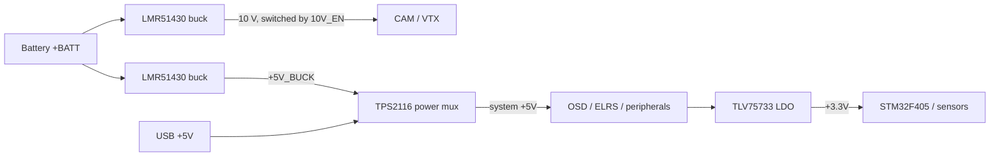

# Dreamscape F405

a 20x20mm flight controller for 3" fpv drone

## Why I made this

would be a nice portfolio project
if it works i save lots of money too

## Pictures

| Page | Sheet |
|---|---|
| 1 | [Root / block diagram](images/schematic/Dreamscape-F405-2020.png) |
| 2 | [Power](images/schematic/Dreamscape-F405-2020-Power.png) |
| 3 | [Sensors](images/schematic/Dreamscape-F405-2020-Sensors.png) |
| 4 | [Blackbox](images/schematic/Dreamscape-F405-2020-Blackbox.png) |
| 5 | [OSD](images/schematic/Dreamscape-F405-2020-OSD.png) |
| 6 | [STM32](images/schematic/Dreamscape-F405-2020-STM32.png) |
| 7 | [Pads / connectors](images/schematic/Dreamscape-F405-2020-Pads.png) |
| 8 | [USB](images/schematic/Dreamscape-F405-2020-USB.png) |

## Features

- **MCU**: STM32F405VGT6
- **IMU**: ICM-42688-P
- **Barometer**: BMP280
- **OSD**: AT7456E (MAX7456-compatible)
- **Blackbox**: full-size microSD slot
- **Receiver**: dedicated JST-SH 4-pin ExpressLRS connector
- **UARTs**: 4 exposed plus I2C pads
- **Power**:
  - Battery input up to 6S
  - 5 V rail: onboard buck regulator
  - 3.3 V rail: TLV75733 LDO
  - 10 V rail: separate buck to feed camera/VTX
  - Onboard battery voltage ADC divider and ESC current sensor input
- **Extras**: beeper driver, neopixel LED strip driver, status LEDs

## Power tree

## Pinout

Solder pads along the edge:

| Pad | Function | Pad | Function |
|---|---|---|---|
| `BAT` | Battery positive | `G` | Ground |
| `3v3` | 3.3 V out | `5v` | 5 V out |
| `10v` | 10 V out (switchable) | `CUR` | ESC current sense in |
| `TEL` | ESC telemetry | `CC` | Camera control |
| `CAM` | Video in from camera | `VTX` | Video out to VTX |
| `M1`-`M4` | Motor PWM outputs | `LED` | Addressable LED strip |
| `BZ+`/`BZ-` | Beeper | `SDA`/`SCL` | I2C |
| `T1`/`R1` | UART1 TX/RX | `T2`/`R2` | UART2 TX/RX |
| `T3`/`R3` | UART3 TX/RX | `T6`/`R6` | UART6 TX/RX |

Connectors:

| Connector | Pins | Use |
|---|---|---|
| J41 - JST-SH 8-pin vertical | BAT, GND, CUR, TEL, M1-M4 | battery + ESC harness |
| J42 - JST-SH 4-pin horizontal | 5V, GND, TX, RX | ExpressLRS receiver |

## Assembly

you probably should get pcba

solder front side first.
hand solder back side

## Flashing

drag the `.bin` onto the mounted DFU drive using the Betaflight Configurator firmware flasher.

Notes:
- If DFU is not accessible, flash via SWD with an ST-Link and `STM32_Programmer_CLI` or OpenOCD instead.

## Known Issues

- Board hasn't been manufactured yet.

## Credits

- OpenDrone
- Betaflight project - firmware this board will run
- STMicroelectronics / TDK / Bosch / Analog Devices datasheets for part reference designs

---

## BOM

| Refs | Part | Package / Footprint | Notes |
|---|---|---|---|
| U1 | STM32F405VGT6 | LQFP-100 14x14 mm | main MCU, 168 MHz Cortex-M4 |
| U6 | ICM-42688-P | LGA-14 | gyro + accel |
| U7 | BMP280 | LGA-8 | barometer |
| U8 | AT7456E | TQFP | MAX7456-compatible OSD |
| Y1 | 27 MHz crystal | 2016 4-pad | OSD clock |
| Card1 | TF-021B-H265 | microSD push-pull slot | blackbox logging |
| U3, U4 | LMR51430 | SOT-23-6 | 3 A buck regulators (10 V and 5 V) |
| U5 | TPS2116DRLR | SOT-583-8 | USB/buck power mux |
| U2 | TLV75733PDBV | SOT-23-5 | 3.3 V LDO |
| Q5, Q6 | AP1606 | DFN-3 | beeper and LED strip drivers |
| D3, D6 | RB161QS-40 | SOD-882 | Schottky diodes (power path) |
| L2, L3 | XRTC303020D4R7 | 3x3 mm | 4.7 uH power inductors |
| D2 | Blue LED | 0402 | status |
| D4, D5, D7 | Green LED | 0402 | power indicators |
| J41 | JST-SH 8-pin | SM08B-SHLS-TF | battery/ESC harness |
| J42 | JST-SH 4-pin | SM04B-SRSS-TB | ELRS receiver |
| R31, R29, R27, R23, R50 | 100 kOhm x5 | 0201 | |
| R2, R39, R49, R50 | 10 kOhm x4 | 0201 | VBAT divider / pull-ups |
| R28 | 39 kOhm | 0201 | buck feedback divider |
| R34, R33 | 7.5 kOhm x2 | 0201 | buck feedback dividers |
| R32 | 13.7 kOhm | 0201 | buck feedback |
| R30 | 6.49 kOhm | 0201 | buck feedback |
| R53, R52 | 75 Ohm x2 | 0201 | |
| R36 | 510 Ohm | 0201 | |
| R51 | 2.4 kOhm | 0201 | |
| R9 | 1 kOhm | 0201 | current sensor filter |
| C24, C25 | 4.7 uF 50 V x2 | 0805 | battery input |
| C29, C28, C34 | 22 uF x3 | 0603/0402 | buck outputs |
| C30 | 4.7 uF | 0402 | |
| C1, C22 | 2.2 uF x2 | 0402 | |
| C4, C36-C39, C43, C32, C26, C27 | 100 nF x10 | 0201 | decoupling |
